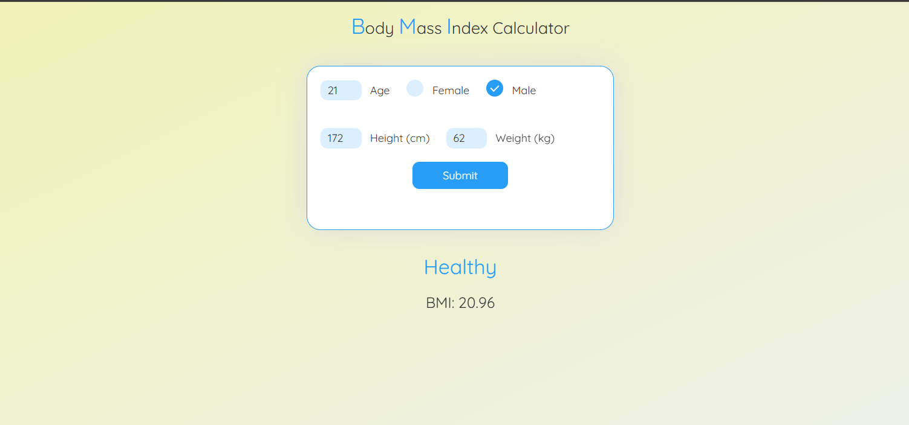

# BMI Calculator

- Created a BMI Calculator using HTML, CSS and JavaScript.
- The Calculator takes the input your age, gender, your height(in cms), your weight(in kg) and gives BMI as the output.
- Its easy to use, you can use it to calculate your BMI.

## Deployment

To deploy this project run

```bash
  Its just a basic HTML, CSS and JS code you can copy and paste this code in your code editor and can see the project.
```

## Features

- Easy to use
- Great interface
- Created just by using basic HTML, CSS and JavaScript code

## Preview



- This is how the project interface looks like.

## Author

Developed by **Yash Yadav**.
